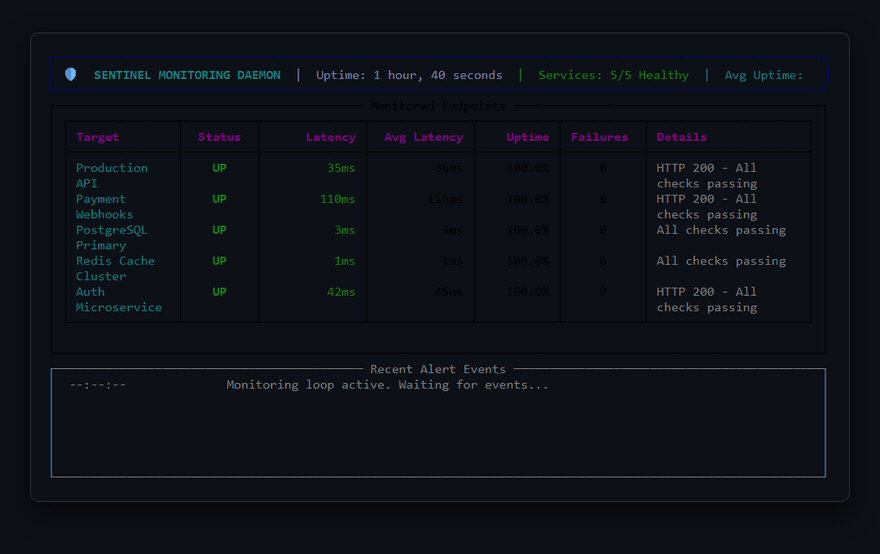
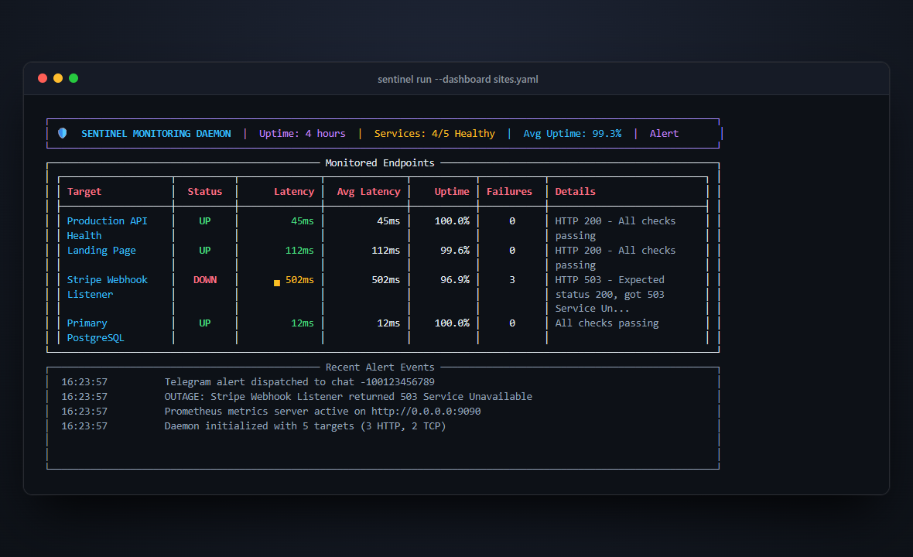
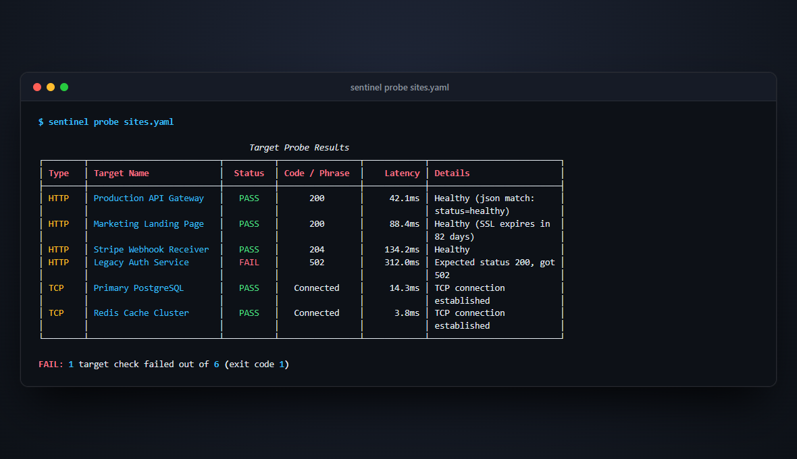
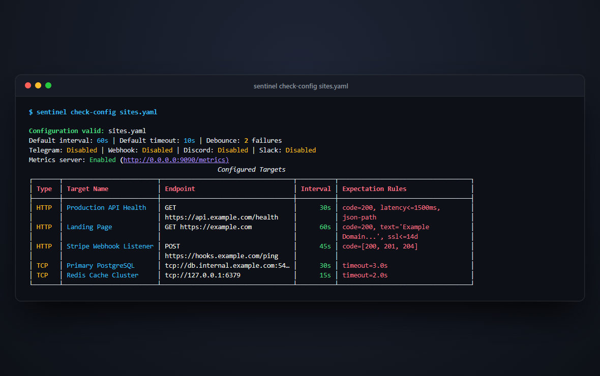
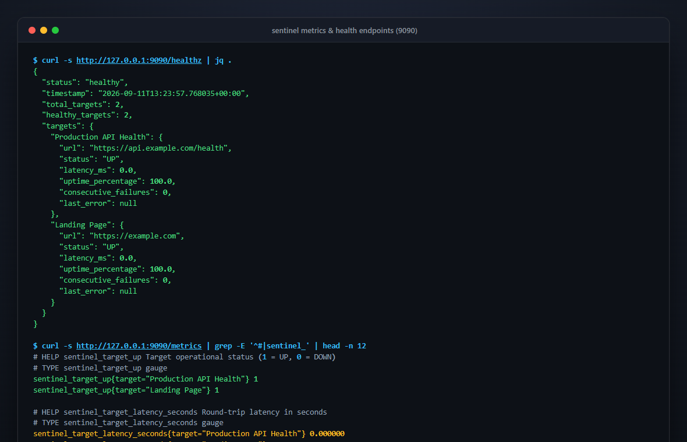

<p align="center">
  
</p>

<h1 align="center">Sentinel</h1>

<p align="center">
  <a href="https://github.com/alexandrmotologa/sentinel/actions/workflows/ci.yml"></a>
  <a href="https://www.python.org/"></a>
  <a href="https://opensource.org/licenses/MIT"></a>
</p>

<p align="center">
  <strong>Lightweight 24/7 Asynchronous Uptime &amp; API Health Monitoring Daemon</strong><br>
  Continuous multi-endpoint surveillance, latency threshold assertions, SSL certificate tracking, and multi-channel alerting with stateful flap protection.
</p>

<p align="center">
  
</p>

## Features

- Non-blocking asynchronous checks powered by `httpx` and `asyncio`
- Flap protection with configurable failure debounce thresholds
- Downtime tracking and recovery notifications with elapsed outage duration
- HTTP assertion rules: status code ranges, max latency, regex, text, and nested JSON keys
- Direct TCP socket connectivity checks for databases (PostgreSQL, MySQL) and caches (Redis)
- Embedded metrics server exposing Prometheus `/metrics` and JSON `/healthz` endpoints
- Multi-channel alerting: Telegram, generic webhooks, native Discord embeds, and Slack Block Kit
- Real-time terminal dashboard (`sentinel run --dashboard`) powered by Rich
- Hot configuration reloading (`sentinel run --watch` or via SIGHUP signal)
- One-off target probing with `sentinel probe` and optional JSON output
- Docker and docker-compose deployment with non-root user and container healthchecks

## Visual Overview

### 1. Interactive Live Terminal Dashboard
Monitor all HTTP and TCP targets in real-time with latency sparkline bars, SLA uptime percentages, and live alert event streaming.

```bash
sentinel run sites.yaml --dashboard
```

<p align="center">
  
</p>

### 2. Immediate One-Off Health Probe
Evaluate all configured targets concurrently and output colored status codes, response latencies, and assertion results.

```bash
sentinel probe sites.yaml
```

<p align="center">
  
</p>

### 3. Configuration Report & Rule Validation
Inspect your `sites.yaml` syntax, enabled alerting channels, and target assertions before launching the daemon.

```bash
sentinel check-config sites.yaml
```

<p align="center">
  
</p>

### 4. Embedded Prometheus Metrics & JSON Healthz Server
Built-in async HTTP service exposing Prometheus exposition metrics on port 9090 for Grafana dashboards and Kubernetes `/healthz` probes.

<p align="center">
  
</p>

## Quick Start

### Installation

```bash
git clone https://github.com/alexandrmotologa/sentinel.git
cd sentinel
pip install -e .
```

### Running Sentinel

1. Copy the example configuration:

```bash
cp sites.example.yaml sites.yaml
```

2. Validate your configuration:

```bash
sentinel check-config sites.yaml
```

3. Run an immediate health probe across all targets:

```bash
# Standard table output
sentinel probe sites.yaml

# Machine-readable JSON output
sentinel probe sites.yaml --json
```

4. Send a test alert to verify notification channels:

```bash
sentinel test-alert sites.yaml
```

5. Start the 24/7 monitoring daemon:

```bash
# Standard output
sentinel run sites.yaml

# Live interactive terminal dashboard
sentinel run sites.yaml --dashboard

# Automatic reload on configuration file changes
sentinel run sites.yaml --watch
```

## Documentation

- [Architecture Guide](docs/architecture.md): Concurrency model, state transitions, and debounce logic.
- [Configuration Reference](docs/configuration.md): Full syntax and options for `sites.yaml`.
- [Metrics and Health](docs/metrics.md): Prometheus `/metrics` exposition and JSON `/healthz` schema.
- [Discord and Slack Alerts](docs/discord_slack.md): Webhook integration and message layouts.
- [TCP Socket Checks](docs/tcp_checks.md): Port monitoring for databases and backend services.
- [Alerting Guide](docs/alerting.md): Telegram templates, sound rules, and notification triggers.
- [Deployment Guide](docs/deployment.md): Running under Docker, systemd, or background processes.

## License

MIT License. See LICENSE for details.
